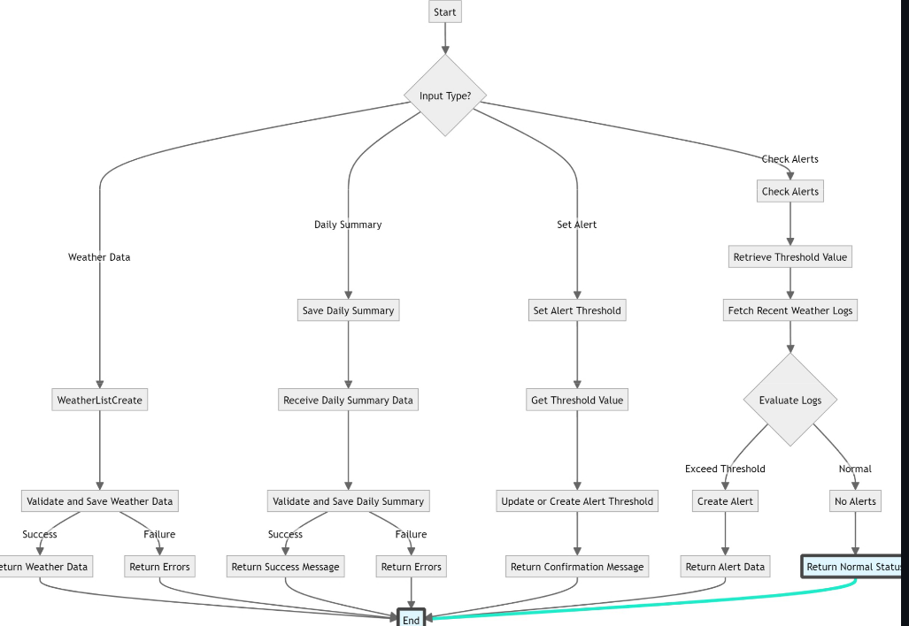
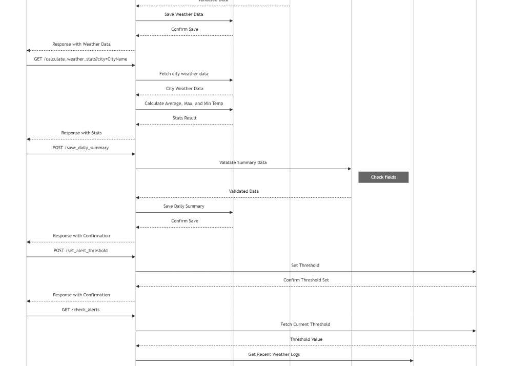
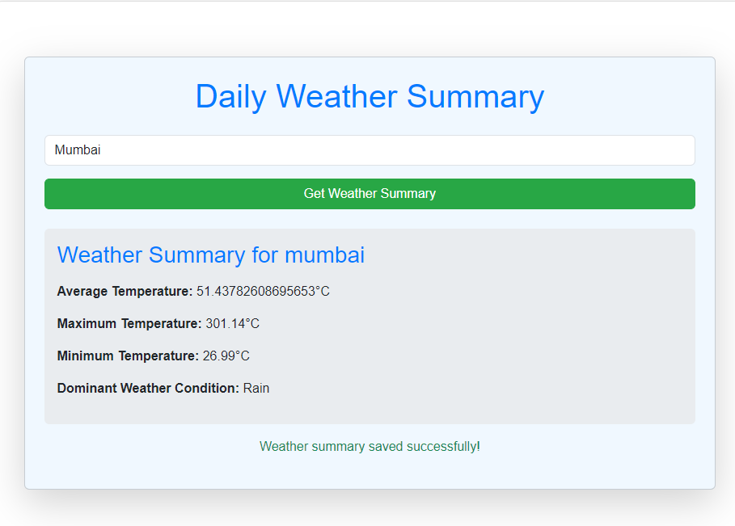
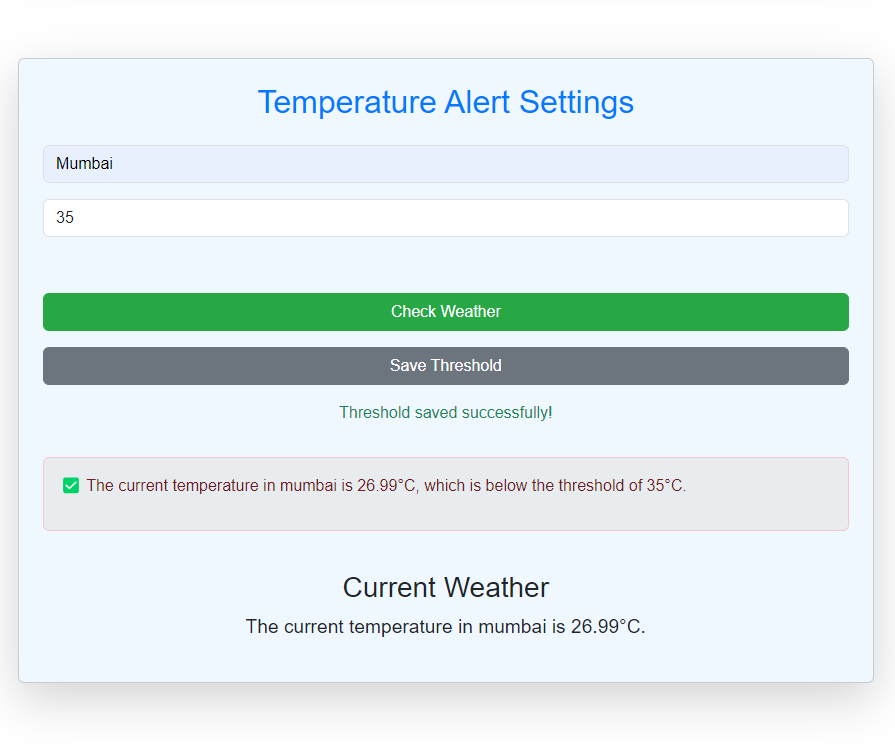
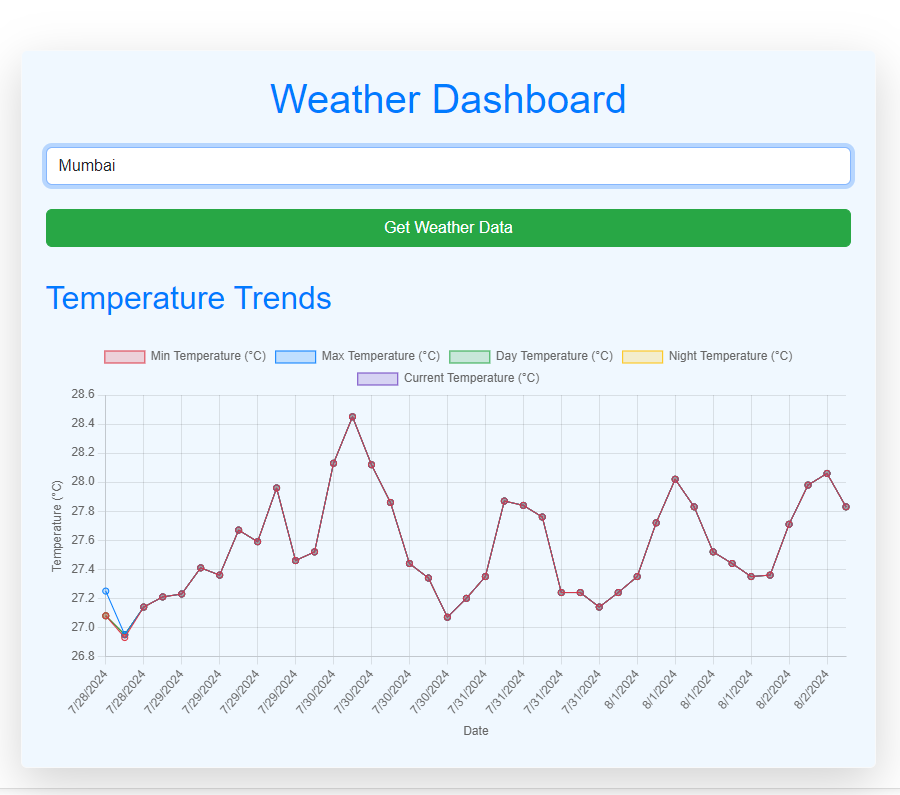

# Real-Time Data Processing System for Weather Monitoring

This project is a Real-Time Data Processing System for Weather Monitoring. It utilizes Django for the backend and React for the frontend. The system is designed to fetch weather data and monitor weather conditions in real-time.

**Note:** This project is developed on a Windows environment.

## Prerequisites

- Python
- Node.js and npm

## Backend Setup

1. **Create a virtual environment:**

    ```sh
    python -m venv env
    ```

2. **Activate the virtual environment:**

    ```sh
    source env/scripts/activate
    ```

3. **Navigate to the project level:**

    ```sh
    cd backend/project_level/
    ```

4. **Run migrations and start the server:**

    ```sh
    python manage.py makemigrations
    python manage.py migrate
    python manage.py runserver
    ```

## Frontend Setup

1. **Install npm:** [Download npm](https://www.npmjs.com/get-npm)

2. **Navigate to the React app directory:**

    ```sh
    cd frontend/my-app
    ```

3. **Initialize npm and install node modules:**

    ```sh
    npm init
    ```

4. **Start the React development server:**

    ```sh
    npm start
    ```
## Flow Chart





## Screen shots








## Additional Information

- Ensure that both the backend and frontend servers are running simultaneously to allow the application to function correctly.
- The backend server typically runs on `http://localhost:8000`, and the frontend server runs on `http://localhost:3000`.
- The application fetches real-time weather data from OpenWeatherMap API. Ensure you have the necessary API keys and configurations set up in your project.

## Contributing

Feel free to fork this repository, make improvements, and submit pull requests. Ensure your contributions align with the project's coding standards and guidelines.

## License

This project is licensed under the MIT License. See the [LICENSE](LICENSE) file for more details.

## Contact

For any questions or inquiries, please open an issue in this repository or contact the project maintainers.
